<div align="center">

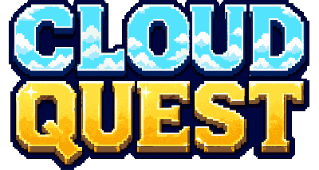

### RPG por turnos donde aprendés Cloud Computing peleando, no leyendo

**Isla 0 — Fundamentos de la Nube** · Hackatón AWS 2026

</div>

---

## El objetivo

**Un novato llega a una isla que se está apagando.** Todo el pueblo dependía de una sola máquina vieja —la
luz, el agua, el molino— y esa máquina ya no da más. La gente se fue.

Un pingüino mentor le dice lo único que importa: *no lo vas a vencer a golpes*. El jugador entra a un
combate por turnos contra ese **Legacy Server** y lo derrota respondiendo cada problema que el jefe grita
con la característica de la nube que lo resuelve.

> ### La regla de oro del diseño
> **El aprendizaje es una CONSECUENCIA de la diversión, nunca el precio de entrada.**

No queremos que el jugador piense *"estoy haciendo un curso de AWS"*. Queremos que piense *"quiero derrotar
a ese jefe"* — y que al terminar diga *"ahhh, entonces para eso sirve la Elasticidad Rápida"*.

| Principio | Qué significa en la práctica |
|---|---|
| **Problemas, no conceptos** | El jefe nunca dice "esto es Rapid Elasticity". Grita un PROBLEMA. El jugador descubre el concepto al resolverlo. |
| **Jugar > leer** | El texto explica en UNA línea, después del golpe. Nunca antes, nunca en párrafos. |
| **Pulido > cantidad** | Un solo nivel impecable vale más que ocho niveles a medias. |

**Criterio de éxito:** el demo gana si, al terminar el nivel, el jurado tiene ganas de ver qué hay en la
Isla 1. Si dicen *"esto lo jugaría mi sobrino para aprender AWS"*, ganamos.

---

## Cómo se ve

<div align="center">
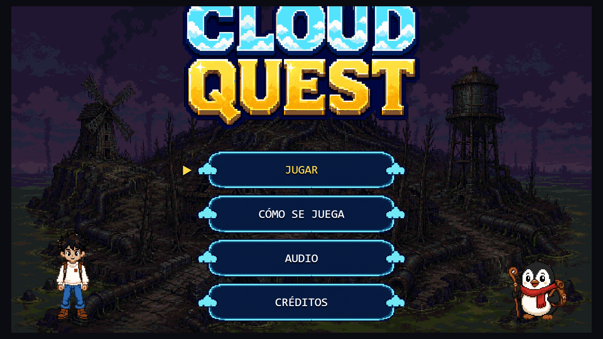
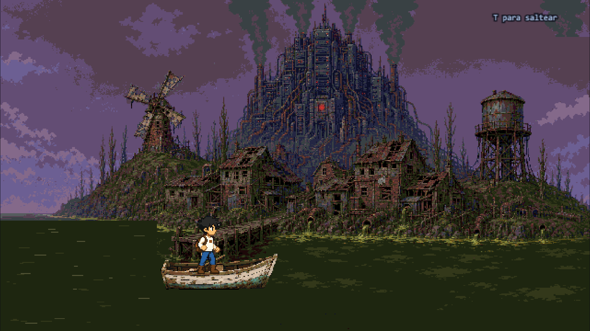
</div>

**Izquierda:** el menú. **Derecha:** llegás a la isla en un bote que apenas cruzó el océano.

<div align="center">
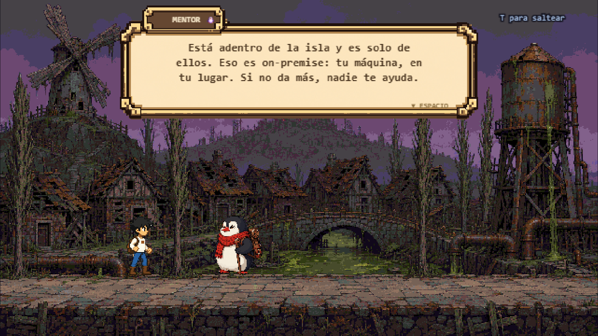
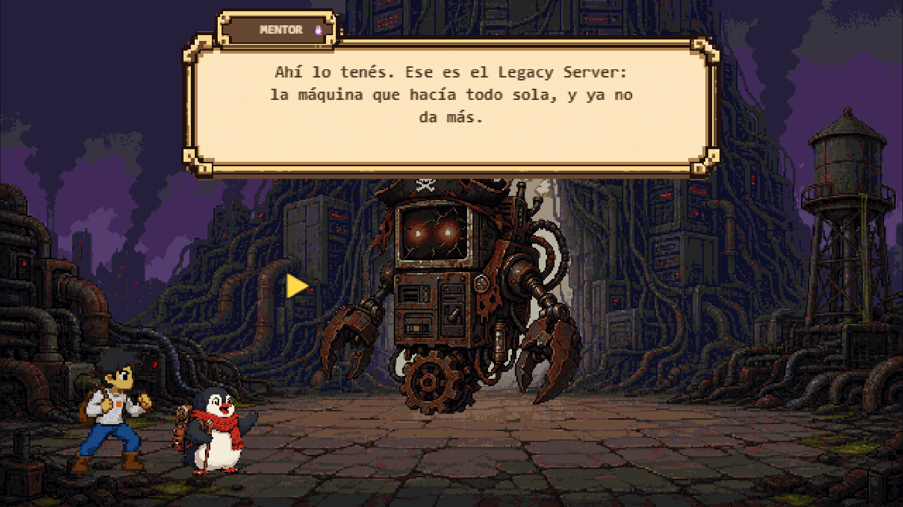
</div>

El mentor te muestra el pueblo enfermo y te nombra dos palabras: **on-premise** y **legacy**.
Ninguna palabra técnica se dice sin algo en pantalla que la sostenga — el molino roto, el agua verde, las
casas tapiadas. Después te lleva a la arena y te señala contra qué vas a pelear.

<div align="center">
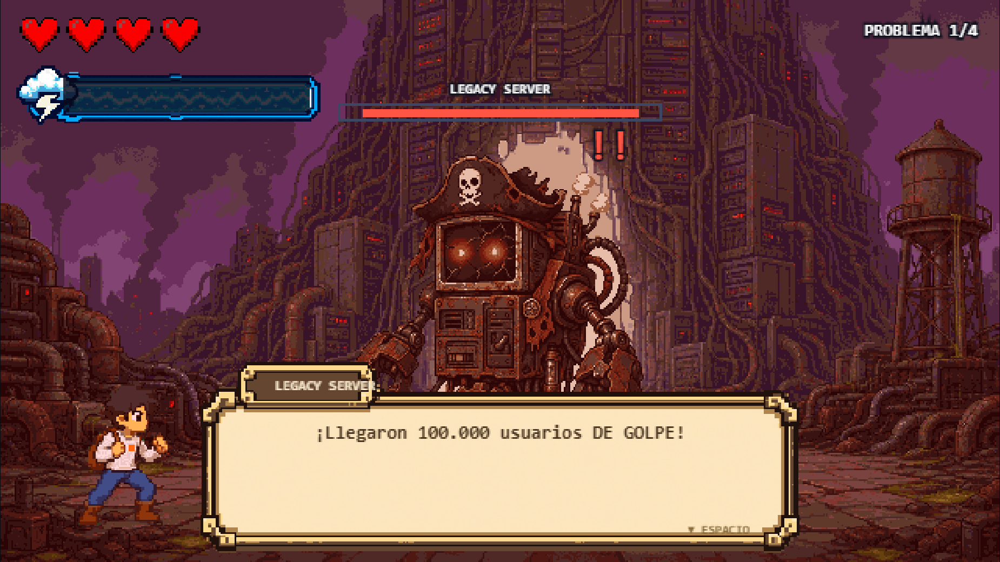
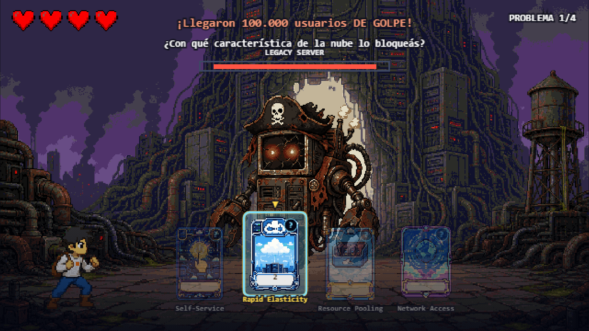
</div>

El jefe grita un problema y vos elegís una de cuatro cartas. **Acá está el aprendizaje.**

<div align="center">
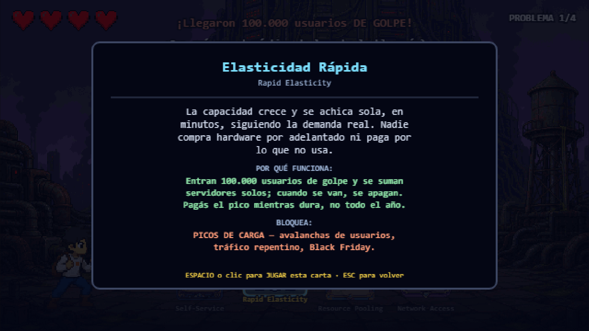
</div>

Cada carta se explica en tres pasos, y los tres hacen falta: **qué ES** la característica, **por qué**
resuelve *este* problema, y **qué tipo de ataque bloquea**. En el tutorial leer la ficha es obligatorio: una
carta que no leíste no se juega, se abre.

<div align="center">
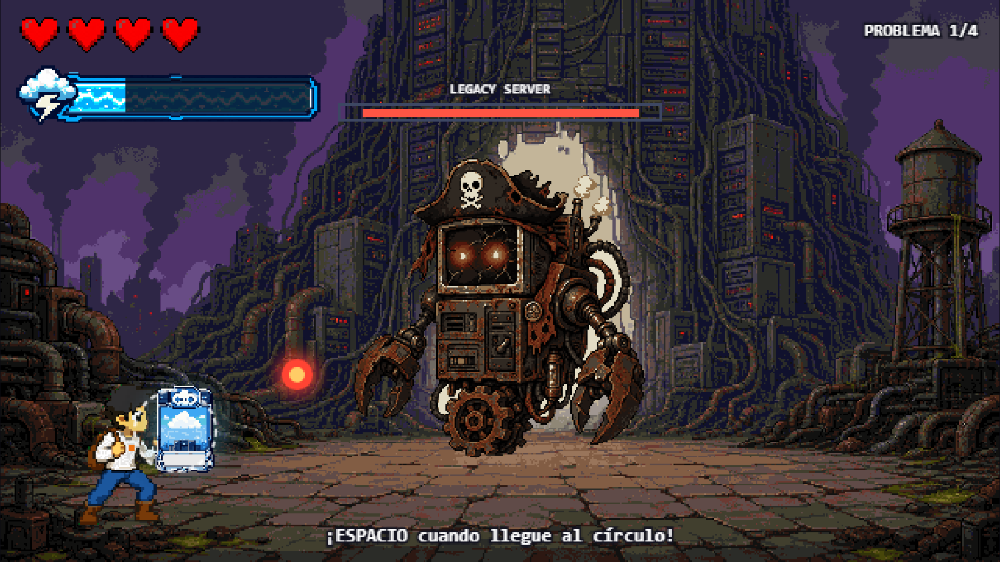
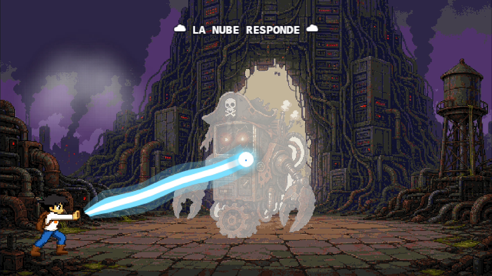
</div>

Al confirmar la carta, el orbe vuela hacia el héroe y hay que apretar en el momento justo. **Acá está la
diversión.** Cuando la barra especial se llena, se dispara el remate.

<div align="center">
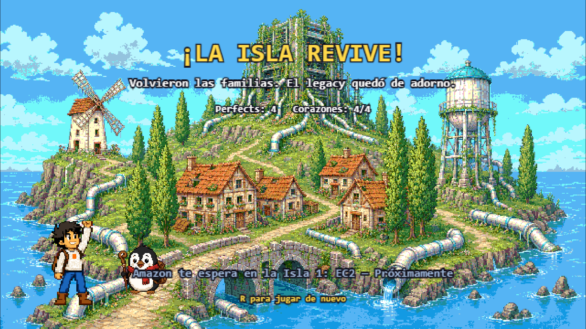
</div>

**No lo destruís a golpes:** sus limitaciones no pueden competir con la nube. Volvieron las familias y el
legacy quedó de adorno.

---

## Los 4 problemas

Son cuatro de las cinco **características esenciales** de la nube según el framework NIST. La quinta
(*servicio medido*) queda para más adelante.

| El jefe grita | Respuesta correcta | Explicación, después del golpe |
|---|---|---|
| *"¡Llegaron 100.000 usuarios de golpe!"* | **Rapid Elasticity** | La nube crece y se achica sola según la demanda. |
| *"¡Necesitás otro servidor YA!"* | **On-Demand Self-Service** | Aprovisionás recursos vos mismo, sin esperar a nadie. |
| *"¡Ahora te entran usuarios de todo el mundo!"* | **Broad Network Access** | Se accede desde cualquier lado a través de la red. |
| *"¡Mil clientes quieren usar la misma máquina!"* | **Resource Pooling** | Muchos clientes comparten la misma infraestructura, seguros y aislados. |

**Carta = aprender. Timing = jugar.** Separados y simples.

## Los sistemas

| Sistema | Diseño |
|---|---|
| **Vida** | 4 corazones. Se pierde uno por carta incorrecta o por fallar el timing. |
| **Timing** | **Perfect** = +25 al especial · **Good** = +20 · **Miss** = perdés un corazón. |
| **Barra especial** | 0..100. Cuatro bloqueos perfectos la llenan exactamente. |
| **Dos fases** | **Tutorial:** te marcan la carta correcta, equivocarse no cuesta vida, el mentor explica siempre. **Revancha:** ninguna ayuda, reloj de 15 s para elegir, y el jefe pega 35% más rápido. |
| **Remate** | El héroe dice *"Encontré una forma mejor"* → la nube responde → el Legacy Server se desintegra. |

> El jefe **no** tiene vida propia como condición de victoria. Cae cuando la barra especial del jugador llega
> a 100. Su barra de vida es representación visual del progreso, nunca una segunda condición de derrota.

---

## Cómo jugar

| Tecla | Qué hace |
|---|---|
| `ESPACIO` / `ENTER` | Avanzar diálogos · **bloquear** el ataque |
| `1` `2` `3` `4` · flechas `←` `→` · clic | Elegir carta |
| `I` | Abrir la ficha de la carta |
| `T` | Saltear la intro |
| `ESC` | Pausa (reiniciar, volver al menú, volumen) |
| `M` | Silenciar la música |
| `R` | Reiniciar |

---

## Correr el proyecto

Necesitás **Node 18 o superior**.

```bash
git clone https://github.com/JDavidcor23/aws_island.git
cd aws_island
npm install
npm run dev          # http://localhost:5173
```

| Comando | Qué hace |
|---|---|
| `npm run dev` | servidor de desarrollo con recarga en caliente |
| `npm run build` | build de producción a `dist/` |
| `npm run preview` | previsualizar el build |

---

## Stack

| Decisión | Elección | Por qué |
|---|---|---|
| **Framework** | React 19 + Vite 6 | El equipo ya sabía JS. Cero curva de motor a días de la entrega. |
| **Render del juego** | Canvas 2D a mano, 640×360 lógicos | Pixel art nítido, control total del timing. |
| **Estado del juego** | Objeto `G` mutado imperativamente | Un loop de juego no necesita el ciclo de render de React. |
| **Estado compartido** | Zustand | Solo eventos discretos: pantalla, fase, stats. |
| **Efectos de sonido** | WebAudio generado en código | Cero archivos, cero latencia de carga. |
| **Despliegue** | Vercel | Deploy automático desde GitHub en cada push a `main`. |

> El diseño original planteaba Godot 4 + S3/CloudFront. Se cambió por plazo y por curva de aprendizaje.
> **No hay que instalar Godot ni tocar AWS para correr esto.**

---

## Arquitectura

### La regla de oro

**React es el shell, el motor es JS puro.**

El loop corre con `requestAnimationFrame` dentro de `GameEngine` y muta su propio estado (`engine.G`).
React **nunca** se entera de un frame. El motor notifica solo **eventos discretos**:

```
GameEngine.setState(state)
  └─ onScreenChange(screen, stats, phase)
       └─ useGameCanvas.hook.js  →  useGameStore
            └─ cualquier hook de React  →  useGameStore((s) => s.phase)
```

> **Prohibido** meter `setState` de React o updates del store dentro del loop del juego. Eso mata el
> rendimiento y es el error más grave que se puede cometer en este codebase.

Si venís de React "normal", esto es lo que más confunde: **no hay componentes que se re-rendericen cuando el
jugador juega.** Hay un `<canvas>` y un objeto `G` que se modifica directamente.

### Rendimiento del canvas

`shadowBlur` y `ctx.filter` **por frame están prohibidos** — son los que hacían sentir lento el prototipo.
Todo glow o flash se pre-renderiza **una sola vez** en `assets.service.js` y en el loop solo se hace
`drawImage`. Y las coordenadas se redondean siempre con `Math.round()`: es pixel art, media unidad de píxel
deja bordes borrosos.

### Estructura

```
src/
├── App.jsx                       # menú → placa de nivel → partida
├── components/
│   ├── GameCanvas/               # el <canvas> + ciclo de vida del motor
│   ├── MainMenu/  MenuList/  LevelCard/  VolumeControls/
├── pages/BattlePage/             # shell React del combate
├── stores/useGameStore.store.js  # screen + phase + stats (eventos discretos, NO frames)
├── services/
│   ├── assets.service.js         # carga sprites + pre-renderiza glows/flashes
│   ├── sfx.service.js            # SFX retro con WebAudio, sin archivos
│   ├── music.service.js          # música con crossfade
│   └── audioSettings.service.js  # volumen persistido en localStorage
├── constants/                    # TODOS los números y textos del juego
│   ├── TIMING.js                 # ← tunear dificultad y tempo SOLO acá
│   ├── LAYOUT.js                 # geometría del canvas 640×360
│   ├── ROUNDS.js  CARDS.js  PHASES.js  BRIEFING.js  INTRO_SCENE.js  ...
└── game/                         # el motor — JS puro, cero React
    ├── GameEngine.js             # loop, input, orquestación update/draw
    ├── battle/                   # battleLogic.js · attack.js · finisher.js
    ├── scenes/                   # introScene.js · briefingScene.js
    ├── fx/effects.js             # partículas y textos flotantes
    └── render/                   # una responsabilidad por archivo
```

Cada componente vive en su carpeta con tres archivos: `Componente.jsx` (solo JSX),
`Componente.css` (sus estilos) y `useComponente.hook.js` (todo el estado, efectos y handlers).

### El objeto `G`

| Campo | Qué es |
|---|---|
| `state` | pantalla actual, uno de los `GAME_STATES` |
| `phase` | `TUTORIAL` o `REMATCH` — **eje ortogonal** a `state`: no dice qué se muestra, dice cómo se comporta |
| `t` · `time` | segundos dentro de la fase · segundos totales |
| `round` · `hearts` · `special` · `perfects` | progreso del combate |
| `atk` | el orbe en vuelo: `{ phase, t, x, y, blocked }` o `null` |
| `intro` · `briefing` · `finisher` | sub-máquinas de escena, nacen en `null` |

`G` se recrea entero en `reset()` (tecla `R`). Cualquier cosa que guardes ahí se resetea gratis.

### Debug

En desarrollo el motor queda expuesto en `window.__CLOUD_QUEST__`. Desde la consola del navegador podés
inspeccionar `__CLOUD_QUEST__.G` en vivo. Las capturas de este README se toman así — ver
[`scripts/shoot_screens.mjs`](./scripts/shoot_screens.mjs).

---

## El arte

Pixel art HD, limpio y muy colorido, semi-anime occidental (*Sea of Stars*, *Eastward*). La paleta es cálida
y saturada en la isla sana; óxido, gris y verde tóxico en la zona del servidor. **El contraste ES la
narrativa: mundo vivo contra tecnología muerta.**

El Legacy Server es un CRT oxidado con forma de capitán pirata. **Viejo y obsoleto, no malvado** — esa
distinción es todo el punto del juego.

Los sprites se generan con el CLI de `codex` y **nunca** se usan crudos:

```
1. GENERAR     codex exec  →  assets/art/generated/<nombre>.png
2. PROCESAR    scripts/*.py →  public/assets/art/_gameready/<nombre>.png
3. REGISTRAR   la clave en src/constants/ASSETS_MANIFEST.js
```

El paso 2 no es opcional: las imágenes del generador vienen con decenas de miles de colores, gradientes y
antialiasing disfrazados de pixel art. Medido, una escena salió con **133.786 colores y 485 KB** contra los
32 colores de los assets originales.

El procedimiento completo, con las seis reglas que costaron corridas perdidas, está en
[`.kiro/steering/arte.md`](./.kiro/steering/arte.md). El registro de cada asset con su prompt exacto está en
[`.kiro/specs/ASSETS.md`](./.kiro/specs/ASSETS.md).

---

## Documentación

| Documento | Qué tiene |
|---|---|
| [`CLOUD_QUEST.md`](./CLOUD_QUEST.md) | el documento maestro de diseño |
| [`.kiro/steering/product.md`](./.kiro/steering/product.md) | qué es el juego, la mecánica, la paleta, el criterio de éxito |
| [`.kiro/steering/tech.md`](./.kiro/steering/tech.md) | stack y las reglas del canvas |
| [`.kiro/steering/structure.md`](./.kiro/steering/structure.md) | dónde va cada cosa, naming, regla anti-conflictos |
| [`.kiro/steering/conventions.md`](./.kiro/steering/conventions.md) | las 10 reglas de código, con ejemplo incorrecto y correcto |
| [`.kiro/steering/arte.md`](./.kiro/steering/arte.md) | cómo se genera y se procesa el arte |
| [`.kiro/specs/`](./.kiro/specs/) | un feature por carpeta: requisitos, diseño y tareas |

Este proyecto usa **Kiro** con specs y steering: todo lo que está en `.kiro/steering/` se carga como
contexto del proyecto, así que no hay que explicarle el codebase.

---

## Convenciones, en resumen

Componente = **solo JSX** · lógica en `use*.hook.js` · CSS por componente, cero estilos inline · constantes
en `src/constants/` con **archivo propio por feature** (nunca agregar a `LAYOUT.js` ni `TIMING.js`, son
compartidos y garantizan conflictos de merge) · Zustand **con selectores granulares**
(`useGameStore(s => s.phase)`, nunca destructuring) y consumido **solo desde hooks** · nada de `src/game/`
importa React · cero `console.log` · una rama por feature, nunca commitear a `main` directo.

**Overlays sobre el canvas:** cualquier `<div>` absoluto encima del `<canvas>` intercepta todos los clics y
el juego deja de responder al mouse, **sin dar ningún error en consola**. Es el bug más caro de diagnosticar
del proyecto. Siempre `pointer-events: none` en el overlay y `auto` solo en lo que debe ser clickeable.

---

## Alcance

**La Isla 0 y nada más**, y dentro de ella un solo combate pulido. El mundo completo — ocho islas: EC2,
Storage, Load Balancing, Auto Scaling, VPC, IAM, Serverless — es roadmap post-hackatón y solo se insinúa en
la pantalla final para generar curiosidad.

## Equipo

**Jorge** · **Nicolás** · **Jennifer** · **Osvaldo**

Arte generado con IA y post-procesado a mano. Hackatón AWS, 2026.

<div align="center">


*Amazon te espera en la Isla 1: EC2 — Próximamente*

</div>
